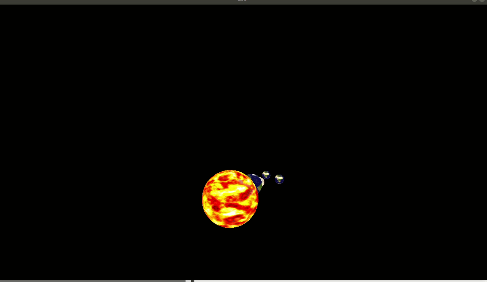
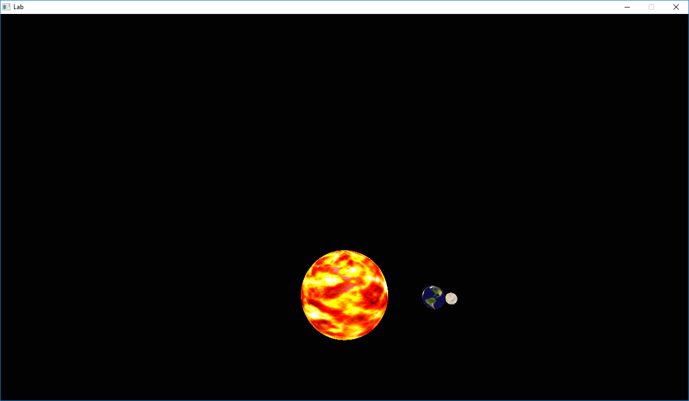

# Assignment - Scenegraph


  
# Resources to help

Some additional resources to help you through this lab assignment

| SDL2 related links                                    | Description                       |
| --------------------------------------------------    | --------------------------------- |
| [SDL API Wiki](https://wiki.libsdl.org/APIByCategory) | Useful guide to all things SDL2   |
| [My SDL2 Youtube Playlist](https://www.youtube.com/playlist?list=PLvv0ScY6vfd-p1gSnbQhY7vMe2rng0IL0) | My Guide for using SDL2 in video form.   |
| [Lazy Foo](http://lazyfoo.net/tutorials/SDL/)         | Great page with written tutorials for learning SDL2. Helpful setup tutorials for each platform. |
| [Lazy Foo - Handling Key Presses](https://lazyfoo.net/tutorials/SDL/04_key_presses/index.php) | Useful tutorial for learning how to handle key presses | 

| OpenGL related links                                | Description                       |
| --------------------------------------------------  | --------------------------------- |
| [My OpenGL Youtube Series](https://www.youtube.com/playlist?list=PLvv0ScY6vfd9zlZkIIqGDeG5TUWswkMox) | My video series for learning OpenGL |
| [docs.gl](http://docs.gl)                           | Excellent documentation to search for OpenGL commands with examples and description of function parameters   |
| [learnopengl.com](https://learnopengl.com)          | OpenGL 3.3+ related tutorial and main free written resource for the course   |


| C++ related links                                   | Description                       |
| --------------------------------------------------  | --------------------------------- |
| [My C++ Youtube Series](https://www.youtube.com/playlist?list=PLvv0ScY6vfd8j-tlhYVPYgiIyXduu6m-L) | My video series playlist for learning C++ |
| [cppreference](https://en.cppreference.com/w/)      | Definitive, more encyclopedic guide to C++ (less beginner focused, but excellent technically) |
| [cplusplus.com](http://www.cplusplus.com)           | Nice website with examples and tutorials geared more for beginners, reference has lots of examples, and the tutorial page is a great starting point |
| [learncpp.com](https://www.learncpp.com/)           | Handy page for learning C++ in tutorial form   |


Links on Scenegraphs
- (**KEY resource**) [Read this tutorial](./media/SceneGraphs.pdf)
- https://www.cs.utexas.edu/users/fussell/courses/cs354/lectures/lecture13.pdf
	- Nice slideshow on scene graphs: 
- https://www.panda3d.org/manual/index.php/The_Scene_Graph
	- Another explanation of scene graphs
- http://www.realityprime.com/blog/2007/06/scenegraphs-past-present-and-future/
	- Tutorial on scene graphs
- http://what-when-how.com/advanced-methods-in-computer-graphics/scene-graphs-advanced-methods-in-computer-graphics-part-3/
	- Implementation of different components in a scene graph
- https://en.wikipedia.org/wiki/Tree_traversal
	- How to traverse the scene graph

# Description

We have learned how to draw models in the previous assignment(s) using the OBJ file format for loading an objects geometry. Additionally, throughout the course we have learned some abstractions to help enable us in creating larger graphical scenes with many objects (e.g. std::vector). However, it can quickly become difficult to manage many different objects in a scene, especially when those scenes are large. In order to create larger graphical scenes, a scenegraph is the dominate data structure used by graphics programmers for organizing data in a scene. For this assignment, we will be focusing on implementing a [scene graph](https://en.wikipedia.org/wiki/Scene_graph) and understanding how transformations of one object are propagated to others.
  
## Assignment Strategy

In order to get started with this assignment, I recommend reading this short .pdf [Read this tutorial](./media/SceneGraphs.pdf). The provided tutorial should give you a nice theoretical and applied example of what you are implementing. Note for this assignment, there *should* not be many code changes required.
  
## Scenegraphs

A scenegraph is nothing more than a 'tree' data structure. There is a root of some 'object' at the top, and then every other object that exists is added into a single tree. There may additionally be other 'nodes' in the tree that have meaning in our 3D scene. For example, lighting, a camera, rigid bodies(for physical simulations), or transformations. 

Here is an example of a scenegraph in a graphics scene.


 ### SceneNode.hpp

In our scenegraph, we only have one type of node (Found in [./include/SceneNode.hpp](./include/SceneNode.hpp)). SceneNode's contain the following information:

```cpp
 protected:
     // Parent
     SceneNode* m_parent;
 private:
     // Children holds all a pointer to all of the descendents
     // of a particular SceneNode. A pointer is used because
     // we do not want to hold or make actual copies.
     std::vector<SceneNode*> m_children;
     // The object stored in the scene graph
     Object* m_object;
     // Each SceneNode nodes locals transform.
     Transform m_localTransform;
     // We additionally can store the world transform
     Transform m_worldTransform;
```

Notice that a SceneNode has a transformation and geometry embedded within them. SceneNode's also know who their parent node is, and all of their children. You may think about how and why we have a local and a world transform stored for our node.
  
Again, the majority of this assignment is understanding how to perform a tree traversal and apply transformations from one object successively to the next. In fact, there are only a few lines of code to implement (Less than 5 lines for the transformation--then the rest of the coding is creating more planets/moons and transforming(rotate/scale/translate) them).

## Part 1 - Usage of Scene graph

## Task 1 - Solar System



For this assignment you are going to create a solar system.

This involves the following:
- Figuring out how to do the scenegraph transformation (stated above).
- Modify `SceneNode::Update(...)` to make sure transformations are pushed from the parent to the child.
- Next, create a solar system with at least 3 planets, and 6 moons.
	- There is a sample provided in: `SDLGraphicsProgram::loop()` for how to use our interface.
	- Feel free to be creative. You may even modify the shader to achieve more interesting renderings of the planets(e.g. scrolling the textures or trying to make them 'glow').

## Task 2 - Why is our scenegraph efficient?

In a few sentences why is our approach of storing a local and world transform more efficient than doing a depth-first traversal to find the final position of an object in world space? Note: There is a handy [tutorial](./media/SceneGraphs.pdf) in the repository including more information on scenegraphs which may help you answer.
  
**Answer here**: Depth-first traversal would involve a lot of unnecessary recursive matrix multiplications compared to our current system of storing each node's local and world transform. This way each node's world transform can be calculated just once and referenced by name indefinitely afterwards rather than having to traverse the whole tree each time a node's world transform is needed. Each node has its own world transform based on its parent's world transform and its own local transform, so you're potentially creating a lot of extra work for your self by not always storing a node's world transform.
  
## How to run your program

Your solution should compile using the [build.py](./build.py) file. That is, we will run your program by typing [python3 build.py](./build.py) and it should just work.

Your program should then run by typing in: `./prog`

# Submission/Deliverables

### Submission

- Commit all of your files to github, including any additional files you create.
- Do not commit any binary files unless told to do so.
- Do not commit any 'data' files generated when executing a binary.

### Deliverables

- A solar system with at least 3 planets and 6 moons.
	- The planets should also rotate around the sun, the moons around each planet.
- Edit the readme to answer Task 2

* You need to commit your code to this repository.


# Going Further

* Try drawing the orbits for the planets and moons (This will make things just slightly cooler looking)
* Try implementing a custom 'planet shader' for each of the planets.
	* For instance, scrolling the uv coordinates on the Sun may make it have an interesting effect!

# F.A.Q (Instructor Anticipated Questions)

* Q: Why a scenegraph?
	* A: It is a standard structure for organizing 3D scenes.
* Q: Can I implement a totally new data structure instead of the one provided?
	* A: Sure
* Q: I compiled the program and I don't see all of the planets.
	* A: The planets might be inside of each other if you have not implemented the appropriate transformations. Feel free to add a 'wireframe' mode (i.e. Hit the <kbd>w</kbd> key to switch to wireframe rendering) to confirm.

# Found a bug?

If you found a mistake (big or small, including spelling mistakes) in this assignment/lab, kindly send me an e-mail. It is not seen as nitpicky, but appreciated! (Or rather, future generations of students will appreciate it!)

- Fun fact: The famous computer scientist Donald Knuth would pay folks one $2.56 for errors in his published works. [[source](https://en.wikipedia.org/wiki/Knuth_reward_check)]
- Unfortunately, there is no monetary reward in this course :)
